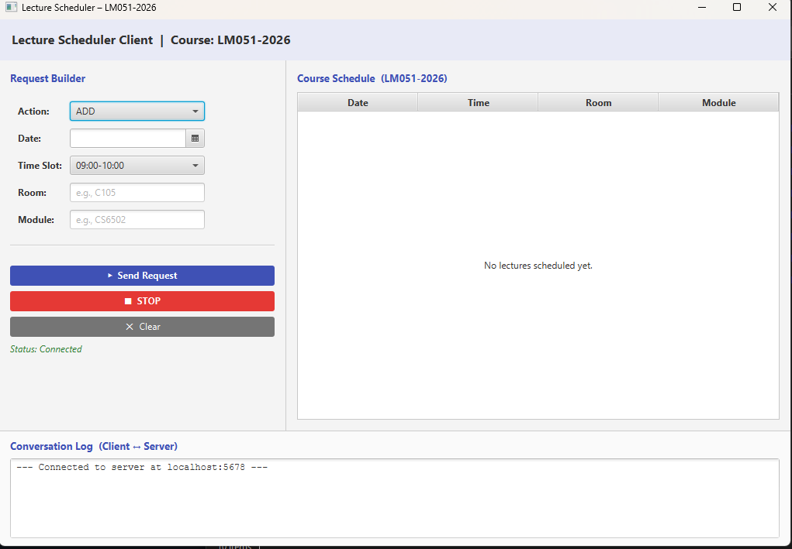
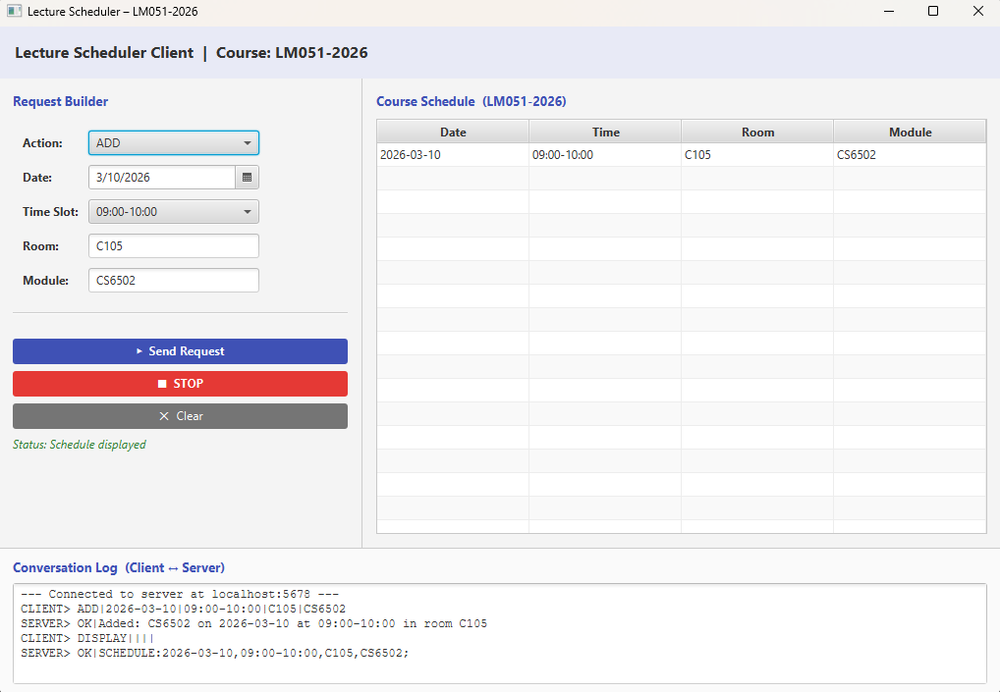
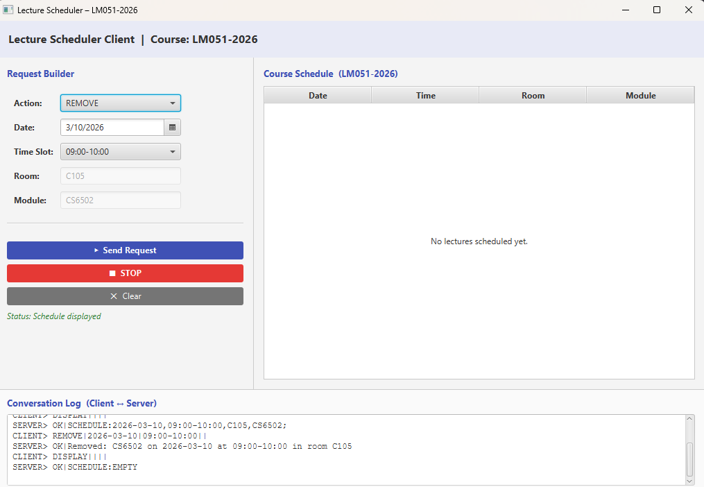

Lecture Timetable Scheduler
Authors: Aisling Walsh 24416762 Luigi Curotto 24423882 

How To Use:
1. Run Server.java
2. Wait until you see "Opening port..."
3. Run App.java

How To Use:
1. Choose an action: ADD, REMOVE, DISPLAY, OTHER
2. Fill in required feilds
3. Click send request
4. After adding or removing lectures use DISPLAY to view changes
5. Click STOP to end the session

Features:
1. Add a lecture
2. Checks for clashes
3. Remove a lecture
4. Display full schedule
5. Handles invalid actions with IncorrectActionException

## Screenshots

